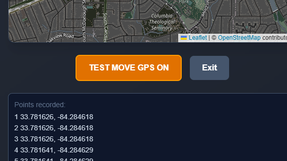
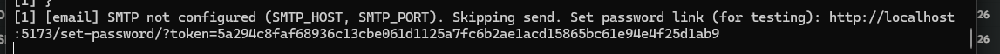
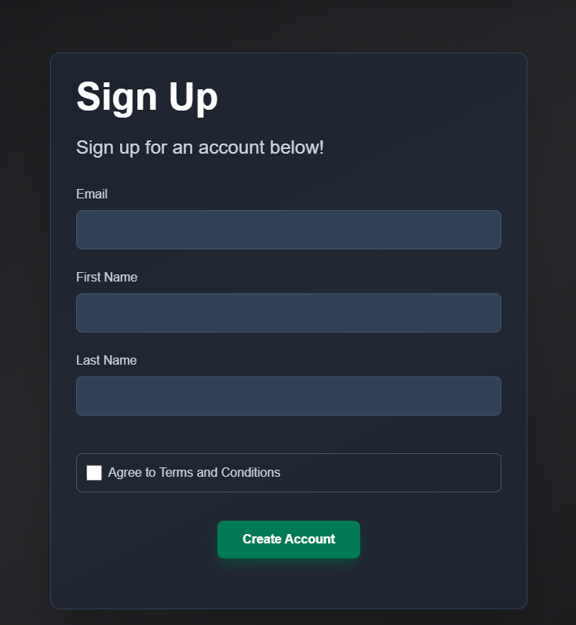
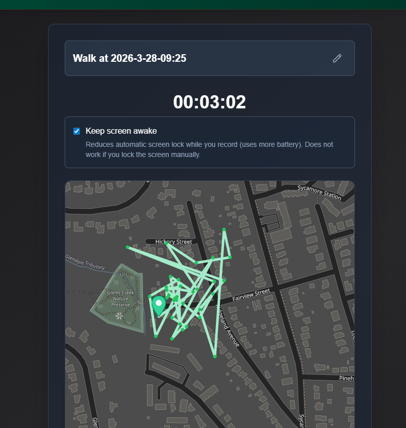
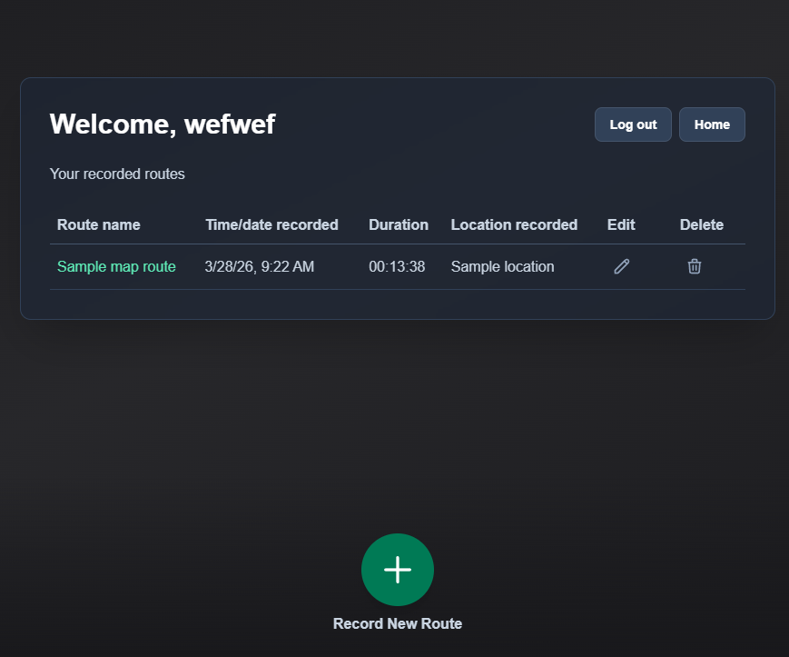
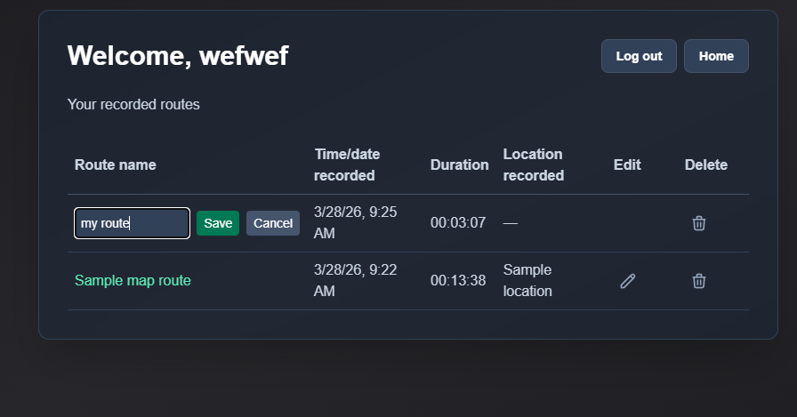
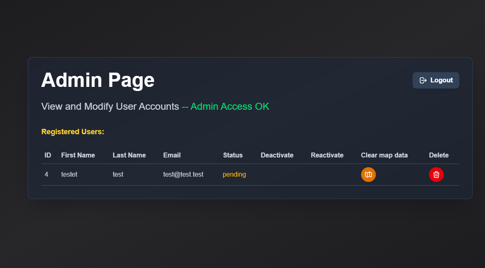

# NoCarBuddy

NoCarBuddy is a proof-of-concept app to track GPS routes for walking and running.  It takes a GPS position update every 5 seconds and plots a route, which can be saved to your user account and reviewed later, calculating distance and average steps.

## Quick Start

**On a mobile device go to the following URL:** 

*(NOTE: TESTED ON IPHONE / iOS Version )*

## App Overview


**This app can be reviewed either locally on a PC (via the TEST MOVE GPS button on the app), or by opening the deployed app on a mobile device (see QUICK START section below)**



Click the TEST MOVE GPS BUTTON to test the app from a stationary PC.  This will artificially add increasing amounts of shift to the fetched gps position to test the mapping feature.

**NOTE -- CHECK THE CONSOLE FOR VERIFICATION LINK IF TESTING LOCALLY:**



### Features:
- Create new user account (sends email verification)



- Record a route



- View recorded routes



- Delete or edit the name of a route



- Admin panel:
    - See user activation status
    - Deactivate / Reactivate a user
    - Delete a user




### Primary technologies used:
- React
- Express
- Postgres
- Tailwind

### APIs used:
- react-leaflet / openstreetmap

## Limitations

**--NOTE--**

As a proof-of-concept testing/dev app, there are limitations to the GPS background fetch capabilities without using react-native.

- You **must have the app fully open** in order for GPS to refresh
- A no sleep function will keep device awake as long as the page is open

At a later point, if this is ported to react-native, the implementation will be redone to allow for GPS tracking to pull data and record while phone is locked.


**--NOTE 2--**

If testing locally, or email verification link is not being delivered, the server will print out the verification link to the console on user creation, which can be used to sign up:


## Quick start

**On a mobile device go to the following URL:** 

*(NOTE: TESTED ON IPHONE / iOS Version )*

## Local setup

To run the app locally and run tests, follow the below instructions:

**1. Install dependencies (root and server), then start the app:**

```bash
npm i
cd server && npm i && cd ..
npm start
```

This runs the React dev server and the Express API together via `concurrently`.

*(NOTE: TESTED ON WINDOWS 11 USING WSL)*

***WSL / Vite build (Rollup):** If `vite build` fails with `Cannot find module @rollup/rollup-linux-x64-gnu`, Rollup’s optional native package for **Linux** was never installed. That usually means **`npm` came from Windows** (e.g. `which npm` shows `/mnt/c/Program Files/nodejs/npm`) while **Node** runs as Linux in WSL—npm installs Windows binaries, but Rollup then looks for the Linux binary at runtime.*

*Running the following command will usually fix the issue (removes and reinstalls all node modules on front end and server):*

```bash
rm -rf node_modules && npm i && cd server && rm -rf node_modules && npm i && cd .. && npm run build
```

**2. Run tests (jest / supertest)**

After installing, run:

```
npm run test
```

*(NOTE: TESTED ON WINDOWS 11 USING WSL)*

## Documentation

Project documentation lives in **docs/**:

- [docs/](docs/) – index of all docs

